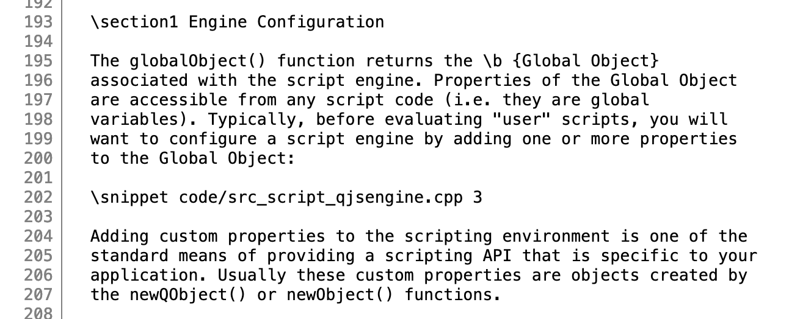
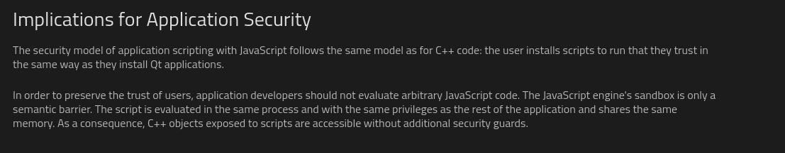
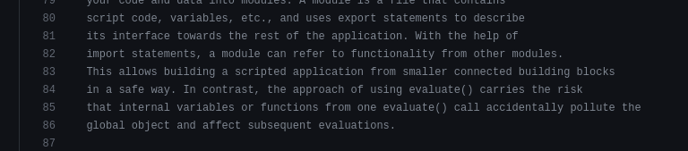

# QJS-Eval-Documentation
Documentation for Summer 2022 Qt-QJSEngine Evaluation


### Resources
Target Resources
- [Target Class Docs](https://doc.qt.io/qt-5/qjsengine.html)
- [Target Class Code](https://github.com/qt/qtdeclarative/blob/dev/src/qml/jsapi/qjsengine.cpp)
- [Qt Quick Conceptual Overview](https://wiki.qt.io/Introduction_to_Qt_Quick)
- [The QML Book](https://qmlbook.github.io/)
- [Qt5 Docs](https://doc.qt.io/qt-5/)
- [JIT Optimization Configs](https://doc.qt.io/qt-5/qtqml-javascript-finetuning.html)
- [QObject Docs](https://doc.qt.io/qt-5/qobject.html)
- [Qt V4 Engine Docs](https://wiki.qt.io/V4)

Fuzzer Resources
- [Fuzzilli](https://github.com/googleprojectzero/fuzzilli)
- [Fuzzilli Dev Fork](https://github.com/theo-morales/fuzzilli)
- [Crashwalk](https://github.com/bnagy/crashwalk)

### TODO

- [X] get jerryscript fuzzilli target working
- [ ] Create Fuzzili QJSEngine Target (Submit PR to github)
    - [X] Compilation Changes
    - [X] Code Coverage
    - [X] Adding Read-Eval-Print-Reset-Loop
    - [X] Adding Custom "fuzzilli" Javascript Builtin
    - [X] Create Fuzzilli Profile
    - [X] create and apply patch on the jsshell
        - [ ] (optional) mmap optimization for reading within reprl
        - [ ] implement FUZZILLI_PRINT
    - [X] figure out which executale is gonna be jsshell... is it qjsengine? update the full path in this readme and future fuzzili commands
- [X] Fuzz 
- [X] Convert notes to markdown -> clean and make into report
- [X] Setup local QT5 engines, spend some time playing with it 
- [x] List functions by priority for fuzzing

## Engine Overview

#### QML 
QML is the C++ language/runtime that allows for a declarative user-interface programming experience based around javascript. It is designed to be used to describe both how the interface looks like and how it behaves.


#### Qt Quick 
Qt Quick refers to the library of components that do the heavy lifting for QML programs. Most of it is written in C++ and our target module, QJSEngine, is responsible for providing the javascript engine functionality


#### QJSEngine
QJSEngine is a C++ class belonging to QT Quick which provides a javascript engine to the QML runtime

Inherits: QObject


## Function Fuzzing Priority List
	        
`evaluate(const QString &program, const QString &fileName = QString(), int lineNumber = 1)`

- Evaluates program, using lineNumber as the base line number, and returns the result of the evaluation
- If an exception is thrown, it will be returned in the QJSValue and can be verified using QJSValue::isError()
- The QJSValue class provides us with the ability to convert the result to a c++ type
- QJSValue::Call(), gives us a way to execute a slot
- **returns**: QJSValue
	
`importModule(const QString &fileName)`

- Imports the module located at filename and returns an object containing its properties and functions
- If it’s the first time its imported, it is evaluated as an ECMAScript module
- Expects UTF-8 text
- Modules should be singletons
- **returns**: QJSValue
	
`setUiLanguage(const QString &language)`

- Sets the language(an extension of the object) to be used for translating ui strings

`fromScriptValue(const QJSValue &value)`

- Converts a qjsvalue to a c++ T type
- Inverse of toScriptValue()
- **returns**: T
	
`toScriptValue(const T &value)`

- Inverse of fromScriptValue
- Converts a c++ type to a javascript object
- **returns**: T
    
`newQMetaObject(const QMetaObject *metaObject)`

- Creates a javascript object that wraps a given QMetaObject(object containing QT metadata)
- metaObject must outlive the script engine
- Recommended to only use with static metaobjects
- **returns**: QJSValue

`QJSEngine(QObject *parent)`

- Scripting engine object
- Its properties are global to the javascript it is parsing, as such, a javascript input can change the configuration of the engine to some degree
- **returns**: QJSEngine\*

`globalObject() const`

- Global engine object that contains properties we can reference and modify from within both the api and the parsed javascript
- **returns**: QJSValue

`collectGarbage()`

- Runs the garbage collector, though apparently QJSEngine does a bit of memory management on its own

`newArray(uint length = 0)`

- Creates a javascript array of length size
- **returns**: QJSValue

`newErrorObject(QJSValue::ErrorType errorType, const QString &message = QString())`

- Creates a javascript error object
- **returns**: QJSValue

`installExtensions(QJSEngine::Extensions extensions, const QJSValue &object = QJSValue())`

- Install javascript extensions to add functionality over the ECMAScript, installed on the given object or the global object if none is specified

`newObject()`

- Creates a javascript object 
- **returns**: QJSValue

`isInterrupted() const`

- shows interuption status of engine execution
- **returns**: bool 

`setInterrupted(bool interrupted)`

- Interrupts or re-enables javascript execution

`throwError(const QString &message)`

- Throws a run-time error with the given message

`~QJSEngine() override`

- Destroys this Engine

`uiLanguage() const`

- property that stores the language used for translating ui strings
- **returns**: QString


## Fuzzing

### Creating the Fuzzilli Target
By following the instructions in the fuzzilli repository, we were able to create a patch to the engine and a fuzzilli profile that allows fuzzili to create javascript bytecode for execution in the QJSEngine and access exit codes

### Environment Setup
Details:
- OS: Ubuntu 20.04
- Qt: 5.12.12

#### Installing Qt

`$  sudo apt-get install -- bison build-essential flex gperf libasound2-dev libatkmm-1.6-dev libbz2-dev libcap-dev libcups2-dev libdrm-dev libegl1-mesa-dev libfontconfig1-dev libfreetype6-dev libglu1-mesa-dev libicu-dev libnss3-dev libpci-dev libpulse-dev libssl-dev libudev-dev libx11-dev libx11-xcb-dev libxcb-composite0 libxcb-composite0-dev libxcb-cursor-dev libxcb-cursor0 libxcb-damage0 libxcb-damage0-dev libxcb-dpms0 libxcb-dpms0-dev libxcb-dri2-0 libxcb-dri2-0-dev libxcb-dri3-0 libxcb-dri3-dev libxcb-ewmh-dev libxcb-ewmh2 libxcb-glx0 libxcb-glx0-dev libxcb-icccm4 libxcb-icccm4-dev libxcb-image0 libxcb-image0-dev libxcb-keysyms1 libxcb-keysyms1-dev libxcb-present-dev libxcb-present0 libxcb-randr0 libxcb-randr0-dev libxcb-record0 libxcb-record0-dev libxcb-render-util0 libxcb-render-util0-dev libxcb-render0 libxcb-render0-dev libxcb-res0 libxcb-res0-dev libxcb-screensaver0 libxcb-screensaver0-dev libxcb-shape0 libxcb-shape0-dev libxcb-shm0 libxcb-shm0-dev libxcb-sync-dev libxcb-sync0-dev libxcb-sync1 libxcb-util-dev libxcb-util0-dev libxcb-util1 libxcb-xf86dri0 libxcb-xf86dri0-dev libxcb-xfixes0 libxcb-xfixes0-dev libxcb-xinerama0 libxcb-xinerama0-dev libxcb-xkb-dev libxcb-xkb1 libxcb-xtest0 libxcb-xtest0-dev libxcb-xv0 libxcb-xv0-dev libxcb-xvmc0 libxcb-xvmc0-dev libxcb1 libxcb1-dev libxcomposite-dev libxcursor-dev libxdamage-dev libxext-dev libxfixes-dev libxi-dev libxrandr-dev libxrender-dev libxslt-dev libxss-dev libxtst-dev perl python ruby`

`$ wget https://download.qt.io/official_releases/qt/5.12/5.12.12/single/qt-everywhere-src-5.12.12.tar.xz`

`$ wget https://download.qt.io/official_releases/qt/5.12/5.12.12/single/md5sums.txt && md5sum qt-everywhere-src-5.12.12.tar.xz && cat md5sums.txt`

`$ xz -d -v qt-everywhere-src-5.12.12.tar.xz`

`$ tar -xvf qt-everywhere-src-5.12.12.tar`

`$ cd qt-everywhere-src-5.12.12.tar.xz && ./configure` 

`$ make -j<n> #where n is cpu cores-1 -d`

#### Installing Swift

`$ wget https://download.swift.org/swift-5.6.1-release/ubuntu2004/swift-5.6.1-RELEASE/swift-5.6.1-RELEASE-ubuntu20.04.tar.gz`
`$ tar -xvf swift-*-RELEASE-ubuntu20.04.tar.gz`

### Deploying the Fuzzer
`$ ./swift-5.6.1-RELEASE-ubuntu20.04/usr/bin/swift build -c debug`

`$ ../swift-5.6.1-RELEASE-ubuntu20.04/usr/bin/swift run -c debug FuzzilliCli ---storagePath=../results -profile=qtjs  /path/to/jsshell`


## Examining Crashes
After running fuzzilli, it generates a `./results` directory which contains a `crashes/` subdir. Inside this subdir are a protobuf and js file for each crash. By using [crashwalk](https://github.com/bnagy/crashwalk), we were able to get some automated insight into whether or not the crashes were likely to be exploitable using 

`$ cwtriage -root <crash/subdir/path> <harness/path> @@`

and compiling into a single human readable output file using 

`$ cwdump crashwalk.db > triage.txt`

After creating the triage.txt file, we created a python script (`instrumentation/results/parser.py`) that creates three seperate directories:
- exploitable/
- not-exploitable/
- prob-exploitable/
- unknown/

each containing their own trimmed version of the triage and the crash files for the respective category

For the exploitable/ directory, we manually debugged each js script using gdb to further subdivide by issue type

#### 0C8904CC08B8_deterministic.js
Minimized Code
 
     function main() { 
     let v1 = [-1.0,-1.0,-1.0];
     v1[1] = v1;
     const v2 = v1--;
     }
     main();

Looks like a self reference issue. Where QJSengine tries to recursively resolve an array that references itself.

````
 2348 0x00007ffff6f64c13 in QV4::RuntimeHelpers::ordinaryToPrimitive(QV4::ExecutionEngine*, QV4::Object const*, QV4::String*) () from /lib/x86_64-linux-gnu/libQt5Qml.so.5
#2349 0x00007ffff6f64f84 in QV4::RuntimeHelpers::objectDefaultValue(QV4::Object const*, int) () from /lib/x86_64-linux-gnu/libQt5Qml.so.5
#2350 0x00007ffff6f6a37b in QV4::Value::toQString() const () from /lib/x86_64-linux-gnu/libQt5Qml.so.5
#2351 0x00007ffff6ecdc60 in ?? () from /lib/x86_64-linux-gnu/libQt5Qml.so.5
#2352 0x00007ffff6ec880c in ?? () from /lib/x86_64-linux-gnu/libQt5Qml.so.5
#2353 0x00007ffff6f64c13 in QV4::RuntimeHelpers::ordinaryToPrimitive(QV4::ExecutionEngine*, QV4::Object const*, QV4::String*) () from /lib/x86_64-linux-gnu/libQt5Qml.so.5
#2354 0x00007ffff6f64f84 in QV4::RuntimeHelpers::objectDefaultValue(QV4::Object const*, int) () from /lib/x86_64-linux-gnu/libQt5Qml.so.5
#2355 0x00007ffff6f6a37b in QV4::Value::toQString() const () from /lib/x86_64-linux-gnu/libQt5Qml.so.5
#2356 0x00007ffff6ecdc60 in ?? () from /lib/x86_64-linux-gnu/libQt5Qml.so.5
#2357 0x00007ffff6ec880c in ?? () from /lib/x86_64-linux-gnu/libQt5Qml.so.5
#2358 0x00007ffff6f64c13 in QV4::RuntimeHelpers::ordinaryToPrimitive(QV4::ExecutionEngine*, QV4::Object const*, QV4::String*) () from /lib/x86_64-linux-gnu/libQt5Qml.so.5
#2359 0x00007ffff6f64f84 in QV4::RuntimeHelpers::objectDefaultValue(QV4::Object const*, int) () from /lib/x86_64-linux-gnu/libQt5Qml.so.5
#2360 0x00007ffff6f6a37b in QV4::Value::toQString() const () from /lib/x86_64-linux-gnu/libQt5Qml.so.5
#2361 0x00007ffff6ecdc60 in ?? () from /lib/x86_64-linux-gnu/libQt5Qml.so.5
````
#### 161BC301CCA5_deterministic.js
Looks like a resource exhaustion issue. Crashes in Chrome as well. The spread ... operator copies the v1 array which is where it crashes

minified code
```
function main() { 
const v1 = [];
v1[4145569500] &= v1;
let [v2,v3,,...v4] = v1;
}
main();
````

back trace
````
#0  0x00007ffff6efc223 in QV4::Object::internalPut(QV4::PropertyKey, QV4::Value const&, QV4::Value*) () from /lib/x86_64-linux-gnu/libQt5Qml.so.5
#1  0x00007ffff6efc0f3 in QV4::Object::internalPut(QV4::PropertyKey, QV4::Value const&, QV4::Value*) () from /lib/x86_64-linux-gnu/libQt5Qml.so.5
#2  0x00007ffff6eed7a6 in ?? () from /lib/x86_64-linux-gnu/libQt5Qml.so.5
#3  0x00007ffff6eeda7a in ?? () from /lib/x86_64-linux-gnu/libQt5Qml.so.5
#4  0x00007ffff6ed07e4 in ?? () from /lib/x86_64-linux-gnu/libQt5Qml.so.5
#5  0x00007ffff6f62729 in QV4::Runtime::IteratorNext::call(QV4::ExecutionEngine*, QV4::Value const&, QV4::Value*) () from /lib/x86_64-linux-gnu/libQt5Qml.so.5
#6  0x00007ffff6f6295c in QV4::Runtime::DestructureRestElement::call(QV4::ExecutionEngine*, QV4::Value const&) () from /lib/x86_64-linux-gnu/libQt5Qml.so.5
#7  0x00007ffff6f4c9de in ?? () from /lib/x86_64-linux-gnu/libQt5Qml.so.5
#8  0x00007ffff6f525af in ?? () from /lib/x86_64-linux-gnu/libQt5Qml.so.5
#9  0x00007ffff6ee54f8 in ?? () from /lib/x86_64-linux-gnu/libQt5Qml.so.5
#10 0x00007ffff6f624c7 in QV4::Runtime::CallName::call(QV4::ExecutionEngine*, int, QV4::Value*, int) () from /lib/x86_64-linux-gnu/libQt5Qml.so.5
#11 0x00007ffff6f4f15e in ?? () from /lib/x86_64-linux-gnu/libQt5Qml.so.5
#12 0x00007ffff6f525af in ?? () from /lib/x86_64-linux-gnu/libQt5Qml.so.5
#13 0x00007ffff6ee472e in QV4::Function::call(QV4::Value const*, QV4::Value const*, int, QV4::ExecutionContext const*) () from /lib/x86_64-linux-gnu/libQt5Qml.so.5
#14 0x00007ffff6f238dc in QV4::Script::run(QV4::Value const*) () from /lib/x86_64-linux-gnu/libQt5Qml.so.5
#15 0x00007ffff6e9ac4a in QJSEngine::evaluate(QString const&, QString const&, int) () from /lib/x86_64-linux-gnu/libQt5Qml.so.5
#16 0x0000000000402474 in main (argc=<optimized out>, argc@entry=0x2, argv=argv@entry=0x7fffffffe408) at harness.cpp:59
#17 0x00007ffff60b1d90 in __libc_start_call_main (main=main@entry=0x402300 <main(int, char**)>, argc=argc@entry=0x2, argv=argv@entry=0x7fffffffe408)
    at ../sysdeps/nptl/libc_start_call_main.h:58
#18 0x00007ffff60b1e40 in __libc_start_main_impl (main=0x402300 <main(int, char**)>, argc=0x2, argv=0x7fffffffe408, init=<optimized out>, fini=<optimized out>, 
    rtld_fini=<optimized out>, stack_end=0x7fffffffe3f8) at ../csu/libc-start.c:392

#19 0x000000000040223a in _start ()
````

#### 1CE5346448E5_deterministic.js
An object, created by `const v0 =/t9/Dj/D/imu;` (TODO: figure out why this is an object... isnt that regex?) is put into an array. the object then has its `__proto__` set to the array it belongs to. dereferencing the values of this array results in the same infinitively recursive looping of calls to `QV4::RuntimeHelpers::ordinaryToPrimitive()` and `QV4::RuntimeHelpers::objectDefaultValue()`

#### 35C0AFC9E167_deterministic.js
array containing object whose `__proto__` references the original array leads to stack overflow due to infinitely recursive looping of calls to `QV4::RuntimeHelpers::ordinaryToPrimitive()` and `QV4::RuntimeHelpers::objectDefaultValue()` as a result of array access

Source code
````
function main() { 
const v0 = {};
const v1 = [v0,v0];
v0.__proto__ = v1;
const v2 = delete v1[v0];
}
main();
// CRASH INFO
// ==========
// TERMSIG: 11
// STDERR:
````


Back trace
````
#0  0x00007ffff6d41470 in QV4::RuntimeHelpers::ordinaryToPrimitive(QV4::ExecutionEngine*, QV4::Object const*, QV4::String*) () from /lib/x86_64-linux-gnu/libQt6Qml.so.6
#1  0x00007ffff6d418e4 in QV4::RuntimeHelpers::objectDefaultValue(QV4::Object const*, int) () from /lib/x86_64-linux-gnu/libQt6Qml.so.6
#2  0x00007ffff6d7398a in QV4::Value::toPropertyKey(QV4::ExecutionEngine*) const () from /lib/x86_64-linux-gnu/libQt6Qml.so.6
#3  0x00007ffff6d3b27b in QV4::Runtime::DeleteProperty_NoThrow::call(QV4::ExecutionEngine*, QV4::Value const&, QV4::Value const&) () from /lib/x86_64-linux-gnu/libQt6Qml.so.6
#4  0x00007ffff6d3b2e3 in QV4::Runtime::DeleteProperty::call(QV4::ExecutionEngine*, QV4::Function*, QV4::Value const&, QV4::Value const&) () from /lib/x86_64-linux-gnu/libQt6Qml.so.6
#5  0x00007ffff6d77087 in ?? () from /lib/x86_64-linux-gnu/libQt6Qml.so.6
#6  0x00007ffff6d7bf6f in ?? () from /lib/x86_64-linux-gnu/libQt6Qml.so.6
#7  0x00007ffff6cd4eb0 in ?? () from /lib/x86_64-linux-gnu/libQt6Qml.so.6
#8  0x00007ffff6d3f707 in QV4::Runtime::CallName::call(QV4::ExecutionEngine*, int, QV4::Value*, int) () from /lib/x86_64-linux-gnu/libQt6Qml.so.6
#9  0x00007ffff6d75ab5 in ?? () from /lib/x86_64-linux-gnu/libQt6Qml.so.6
#10 0x00007ffff6d7bf6f in ?? () from /lib/x86_64-linux-gnu/libQt6Qml.so.6
#11 0x00007ffff6cd3ada in QV4::Function::call(QV4::Value const*, QV4::Value const*, int, QV4::ExecutionContext const*) () from /lib/x86_64-linux-gnu/libQt6Qml.so.6
#12 0x00007ffff6d480fc in QV4::Script::run(QV4::Value const*) () from /lib/x86_64-linux-gnu/libQt6Qml.so.6
#13 0x00007ffff6c69b24 in QJSEngine::evaluate(QString const&, QString const&, int, QList<QString>*) () from /lib/x86_64-linux-gnu/libQt6Qml.so.6
#14 0x0000000000402524 in main (argc=<optimized out>, argc@entry=0x2, argv=argv@entry=0x7fffffffe3f8) at harness.cpp:60
#15 0x00007ffff5ec3d90 in __libc_start_call_main (main=main@entry=0x402360 <main(int, char**)>, argc=argc@entry=0x2, argv=argv@entry=0x7fffffffe3f8)
    at ../sysdeps/nptl/libc_start_call_main.h:58
#16 0x00007ffff5ec3e40 in __libc_start_main_impl (main=0x402360 <main(int, char**)>, argc=0x2, argv=0x7fffffffe3f8, init=<optimized out>, fini=<optimized out>, rtld_fini=<optimized out>, 
    stack_end=0x7fffffffe3e8) at ../csu/libc-start.c:392
#17 0x0000000000402295 in _start ()
````
#### 3F6451F7F2E0_deterministic.js
Same backtrace as [0C8904CC08B8_deterministic](https://github.com/EmmaReuter/QJSEngine-Fuzzili-Wrapper/tree/dev#0c8904cc08b8_deterministicjs)


#### 6235D04848D4_deterministic.js
Same backtrace as [0C8904CC08B8_deterministic](https://github.com/EmmaReuter/QJSEngine-Fuzzili-Wrapper/tree/dev#0c8904cc08b8_deterministicjs)

#### 815BE7154BE2_deterministic.js
Same backtrace as [0C8904CC08B8_deterministic](https://github.com/EmmaReuter/QJSEngine-Fuzzili-Wrapper/tree/dev#0c8904cc08b8_deterministicjs)

#### 817E6A9297C7_deterministic.js
same backtrace as [35C0AFC9E167_deterministic.js](https://github.com/EmmaReuter/QJSEngine-Fuzzili-Wrapper/tree/dev#35c0afc9e167_deterministicjs)


#### A5A7929C887D_deterministic.js,
same backtrace as [35C0AFC9E167_deterministic.js](https://github.com/EmmaReuter/QJSEngine-Fuzzili-Wrapper/tree/dev#35c0afc9e167_deterministicjs)

#### AA77C4487451_deterministic.js
same backtrace as [35C0AFC9E167_deterministic.js](https://github.com/EmmaReuter/QJSEngine-Fuzzili-Wrapper/tree/dev#35c0afc9e167_deterministicjs)


#### C1E89367B35D_deterministic.js,
same backtrace as [35C0AFC9E167_deterministic.js](https://github.com/EmmaReuter/QJSEngine-Fuzzili-Wrapper/tree/dev#35c0afc9e167_deterministicjs)

#### C2F77C963AF8_deterministic.js
same backtrace as [35C0AFC9E167_deterministic.js](https://github.com/EmmaReuter/QJSEngine-Fuzzili-Wrapper/tree/dev#35c0afc9e167_deterministicjs)

#### C6CBA8CCCD27_deterministic.js
same backtrace as [35C0AFC9E167_deterministic.js](https://github.com/EmmaReuter/QJSEngine-Fuzzili-Wrapper/tree/dev#35c0afc9e167_deterministicjs)

#### CB19DA296980_deterministic.js, 
same backtrace as [35C0AFC9E167_deterministic.js](https://github.com/EmmaReuter/QJSEngine-Fuzzili-Wrapper/tree/dev#35c0afc9e167_deterministicjs)

#### DCE96D3007C6_deterministic.js,
same backtrace as [35C0AFC9E167_deterministic.js](https://github.com/EmmaReuter/QJSEngine-Fuzzili-Wrapper/tree/dev#35c0afc9e167_deterministicjs)

#### E01C6AF02537_deterministic.js 
same backtrace as [35C0AFC9E167_deterministic.js](https://github.com/EmmaReuter/QJSEngine-Fuzzili-Wrapper/tree/dev#35c0afc9e167_deterministicjs)

#### E073A481BE1C_deterministic.js 
same backtrace as [35C0AFC9E167_deterministic.js](https://github.com/EmmaReuter/QJSEngine-Fuzzili-Wrapper/tree/dev#35c0afc9e167_deterministicjs)

## Interesting Finds

#### Javascript can access and modify the Engine its running within



Code to recreate overwriting of global objects
 
    myEngine.globalObject().setProperty("value", 123);
    myEngine.evaluate("value = 1337;");
    myEngine.evaluate("print(value)");
    // value is 1337 
    
#### Denial of service
QJSEngine has no [abort](https://bugreports.qt.io/browse/QTBUG-49080) function. So it is possible to make the engine not terminate.
 
    myEngine.evaluate("while(1) {}");

#### Can cause the engine to run out of memory
[link](https://stackoverflow.com/questions/16797423/how-to-handle-v8-engine-crash-when-process-runs-out-of-memory)
#### Note about application security




#### Code from one evaluation can pollute the global object used by the next evaluation




#### Lack of support for async
when testing the interpreter, we found that since qt6 runs a main GUI thread that it doesn't like to have blocked, running async functions in this thread is dissalowed and an alternative is provided by the QJSEngine::WorkerScript function

TODO: verify with screenshots

#### Lack of support for throw

TODO: verify with screenshots


## Further Research

#### Asynchronous Function Testing
We did not use the asynchronous code generators due to Qjsengine not exposing an `async` keyword and instead only allowing multi-threading through the use of a `QtQML::WorkerScript` function. Future research could build off this instrumetation by modifying fuzzilli to use the WorkerScript functionality to test multi-threading

#### importModule Testing
the importModule function expects utf8 text representing the name of a module. It might be wise to verify that correct safeguards are in place within the code that restrict non-utf8 text from being processed.
